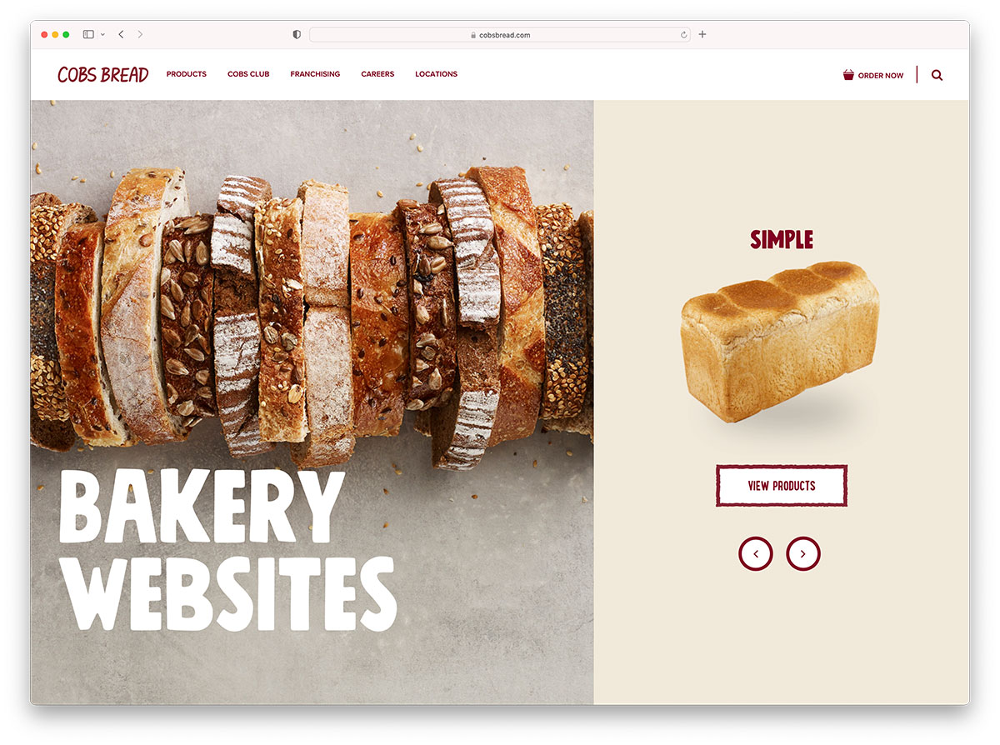
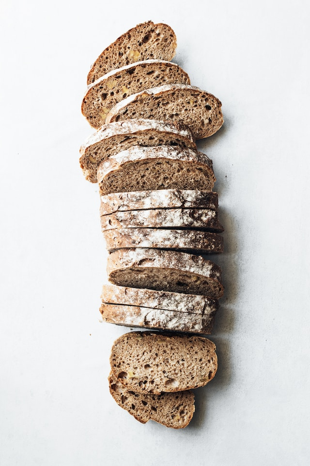
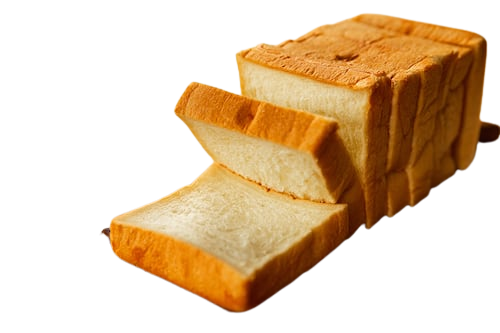

# Instructions
Recreate the image below:


Most of the code is provided for you. Try to type every line by hand and see the results

## HTML

- put the code below under `<!-- Header -->`

```html
    <header>
            <nav>
                <div class="brand">
                    Cobs Club
                </div>
                <ul>
                    <li><a href="">Products</a></li>
                    <li><a href="">Cobs Club</a></li>
                    <li><a href="">Blog</a></li>
                    <li><a href="">Careers</a></li>
                    <li><a href="">Locations</a></li>
                </ul>
            </nav>
            <div class="extra">
                <a href="" class="fa fa-shopping-bag"> Order Now </a> 
                <button class="fa fa-search search-btn"></button>
            </div>
        </header>
```

- put the code below under `<!-- Main -->`
```html
    <main>
      <div class="hero">
        
        <h1 class="hero-text">Cobs Bread</h1>
      </div>

      <section class="main-section">
        <div class="product">
          <h2>Simple</h2>
          
          <a href="" class="btn">View Product</a>
          <div>
            <a href="" class="fa fa-arrow-left next-btn btn"></a>
            <a href="" class="fa fa-arrow-right prev-btn btn"></a>
          </div>
        </div>
      </section>
    </main>
```

## CSS
- Put the line below at the top of the **style.css**
```css 
@import url('normalize.css'); 
```
after `/* import normalize.css */`

- Put the line below at the top of the **style.css**
```css 
:root {
    --main : #522c11;
    --white: #fefefe;
    --secondary: #e9c4a9;
}

body {
    min-height: 100vh;
    color: var(--main);
}
```
after `/* variables */`

- put the code below under `/* Header Styles */` in between 
```css
    header, header > nav, header > nav > ul {
    display: flex;
    align-items: center;
}

header {
    justify-content: space-between;
    padding: 10px 15px;
    background-color: var(--white);
}

header > nav > ul {
    list-style: none;
}

header a {
    text-decoration: none;
    display: inline-block;
    padding: 10px 15px;
    color: inherit;
}


header > nav > ul > li > a {
    border-bottom: 1px solid transparent;
}

header > nav > ul > li > a:hover {
    border-bottom: 1px solid var(--main);
}

header .extra a:first-child {
    border-right: 1px solid var(--main);
}

.brand {
    font-size: 2em;
    font-family: cursive Arial, Helvetica, sans-serif;
    font-style: italic;
    font-weight: 900;
}
```
- put the code below under `/* Main Styles */`
```css
    main {
    display: grid;
    grid-template-columns: 3fr 2fr;
}

.hero {
    position: relative;
    display: flex;
    align-items: last baseline;
}

.hero-img {
    display: block;
    position: absolute;
    top: 0;
    width: 100%;
    height: 100%;
    object-fit: cover;
    object-position: center;
    z-index: -1;
    
}

.hero-text {
    padding: 10px 15px;
    font-size: 4em;
    text-transform: uppercase;
}

.main-section, .main-section > .product{
    display: grid;
    place-items: center;
    padding: 10px 15px;
}

.main-section > .product > .product-img {
    width: 100%;
    height: 100%;
    filter: drop-shadow(-10px 20px 10px rgba(0, 0, 0, .5));
}

.btn {
    text-decoration: none;
    color: inherit;
    padding: 10px 15px;
    margin-top: 10px;
    margin-bottom: 15px;
    border: 1px solid var(--main);
}

.prev-btn, .next-btn {
    margin-top: 10px;
    border-radius: 50%;
    width: 50px;
    height: 50px;
    margin: 10px 15px;
}
```

